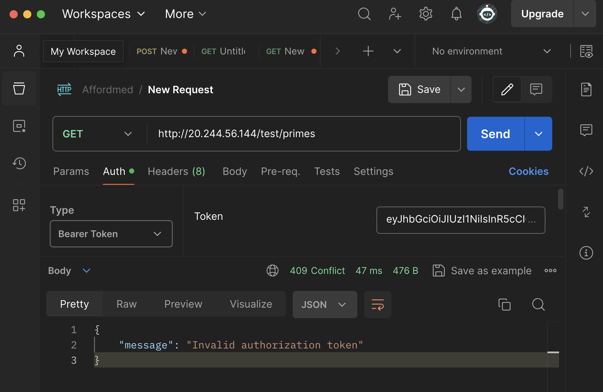
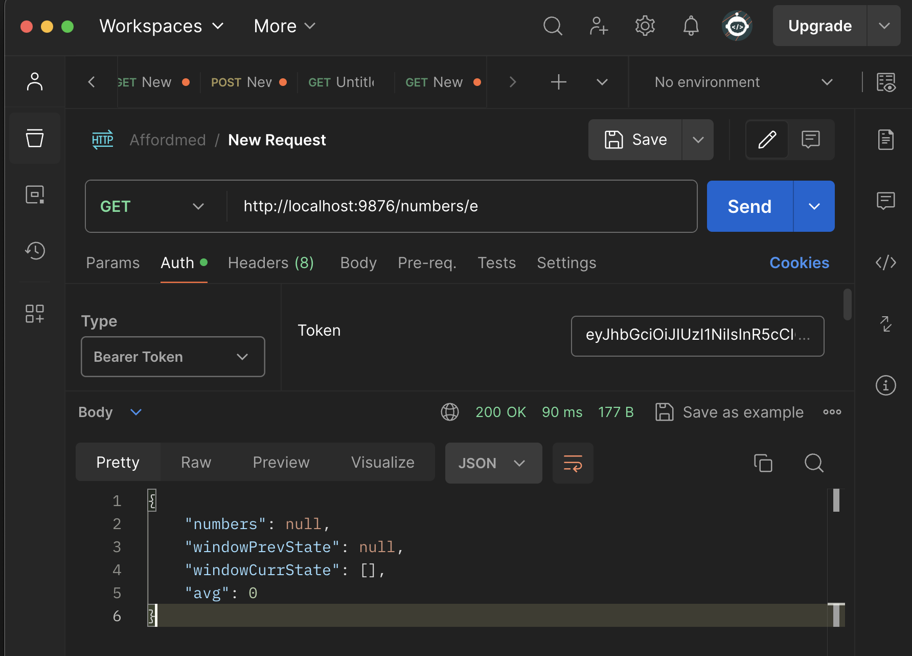

# Number Fetcher

## Overview

The Number Fetcher is a simple Go program that provides an HTTP server to fetch and analyze numbers from various endpoints. It exposes endpoints to fetch different types of numbers (e.g., primes, Fibonacci, even numbers) and calculates statistics on the fetched data.

## Features

- Fetches numbers of different types from external test servers.
- Calculates average and maintains a sliding window of fetched numbers.
- Provides JSON responses containing fetched numbers, window states, and averages.

## Usage

1. **Installation**:
   - Ensure you have Go installed on your system.
   - Clone this repository to your local machine.

2. **Dependencies**:
   - This program uses only standard Go libraries, so there are no external dependencies to install.

3. **Configuration**:
   - Update the `bearerToken` variable with your authentication token.
   - Modify the `testServerURLs` map to include the appropriate URLs for fetching different types of numbers.

4. **Run the Server**:
   - Navigate to the directory containing the `main.go` file.
   - Run the following command:
     ```
     go run main.go
     ```
   - The server will start running on port 9876.

5. **Access Endpoints**:
   - Use an HTTP client tool like curl or Postman to access the following endpoints:
     - `/numbers/{type}`: Fetch numbers of a specific type (`p` for primes, `f` for Fibonacci, `e` for even, `r` for random).
     - Example: `http://localhost:9876/numbers/p`

6. **Responses**:
   - Each endpoint returns a JSON response containing the fetched numbers, window states, and averages.


